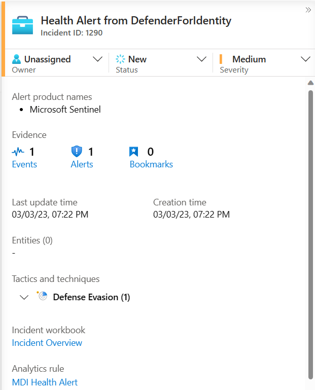

# Defender for Identity - my cheat sheet
## Installation tips

### Capacity planning
Make sure you start with this capacity planning tool execution before anything else.
https://learn.microsoft.com/en-us/defender-for-identity/capacity-planning
When analyzing the results, look at the peaks: maybe you have some process (backup or similar) responsible of this peak: you might optimize the required resources by applying some throttling on this process (for instance make the backup process do the job in 4 hours instead of 1).

### Script to check installation prerequisites
Recently this nice Test-MdiReadiness.ps1 script has been made available, make sure to leverage it to simplify deployment.
See https://learn.microsoft.com/en-us/defender-for-identity/deploy-defender-identity

### Proxy requirements notes
"Blocking Internet Access for Domain Controllers" official AD security recommendation was updated precisely to cover Defender for Identity internet requirements: 
>Whilst this hybrid model exists in any organization, Microsoft recommends cloud powered protection of those on-premises identities using Microsoft Defender for Identity. The configuration of the Defender for Identity sensor on domain controllers and AD FS servers allows for a highly secured, one-way connection to the cloud service through a proxy and to specific endpoints. A complete explanation on how to configure this proxy connection can be found in the technical documentation for Defender for Identity. This tightly controlled configuration ensures that the risk of connecting these servers to the cloud service is mitigated, and organizations benefit from the increase in protection capabilities Defender for Identity offers. Microsoft also recommends that these servers are protected with cloud powered endpoint detection like Microsoft Defender for Servers. 
Source: https://learn.microsoft.com/en-us/windows-server/identity/ad-ds/plan/security-best-practices/securing-domain-controllers-against-attack#blocking-internet-access-for-domain-controllers

Required urls:
- <your-instance-name>.atp.azure.com – for console connectivity. For example, contoso-corp.atp.azure.com
- <your-instance-name>sensorapi.atp.azure.com – for sensors connectivity. For example, contoso-corpsensorapi.atp.azure.com

Simple path => configure the proxy using the installation commandline:
```
"Azure ATP sensor Setup.exe" [/quiet] [/Help] [ProxyUrl="http://proxy.internal.com"] [ProxyUserName="domain\proxyuser"] [ProxyUserPassword="ProxyPassword"]
```

## POC tips
- Use the installatation prerequisites powershell tool to make sure you did not forget to configure some important event logs or other prerequisites.
- Enable the "POC mode", by disabling the learning period: https://learn.microsoft.com/en-us/defender-for-identity/advanced-settings#removing-the-learning-period-for-alerts
- Good references to simulate some attacks and learn how the product works:
    - Simulate attacks: https://github.com/DanielpFR/MDI/blob/main/MDI_Playbook_Sample.md
    - Advanced hunting: https://github.com/DanielpFR/MDI 
    - Microsoft docs: https://learn.microsoft.com/en-us/defender-for-identity/playbooks

## Defender for Identity Health Alerts
Defender for Identity may generate health alerts in case of an health-related issue. See https://learn.microsoft.com/en-us/defender-for-identity/health-alerts for more information.
Unfortunately at the time of this writing (march 2023), those alerts are not available through an API.

UPDATE APRIL 2023: there is also the option to send health alerts by using the syslog agent! See https://learn.microsoft.com/en-us/defender-for-identity/notifications#syslog-notifications

> [!IMPORTANT]
> **-- IMPORTANT UPDATE APRIL 2024 --**
> **Now those alerts are available through the Microsoft Graph API (beta), so the section after is becoming obsolete!**
> **See https://learn.microsoft.com/en-us/graph/api/resources/security-healthissue?view=graph-rest-beta** 

The goal of this section is to describe one workaround to get those alerts automatically sent to your Log Analytics workspace for centralized monitoring purposes.
As alerts can be sent through email notification, the idea is to create a Logic App that will parse this email and create a new log entry in a Log Analytics Workspace.

### 1. Configure alert notifications
- Go to Defender for Identity settings page, Notifications / Health issues notifications: https://security.microsoft.com/settings/identities?tabid=healthIssuesNotifications
- Add the SOC shared mailbox email address


### 2. Create a Logic App
- Now the idea is to create a Logic App that will automatically log the info into your own monitoring database, a log analytics workspace in this example.
- This simple logic app is composed by a "When a new email arrives (V3)" action, a compose action and several JS inline code to manipulate the string object and the "Send Data" action responsible to send the log info through a JSON object
>Note: As I am not a Logic app expert it might not be the more efficient way to do it; I am also looking for best practices to parse the HTML email body and grab more information from it, reach out to me if you have a recommendation :-)


You can find the logicapp sample template here: [JSON template](health/logicapp-template.json)

### 3. Validate
- Make sure at least one run occured (for that you need to get one new health alert sent to the mailbox)
- Check that the Custom Logs table has been created in the log analytics workspace
>Once you have at least received one email from MDI, you can replay it going into the history of the logic app and clicking on "Resubmit"


- Check that a new entry exists in this table
>It can take a few minutes

### 4. Option: create an alert in Sentinel
- Finally, if you are using Microsoft Sentinel on top of the Log Analytics workspace, you may want to get a new incident created when such MDI health alerts occur

- From the Configuration / Analytics menu, create a new NRT (near-real time) rule so every time a new entry shows up in the custom table you get an incident created 


- Here is what an incident looks like
