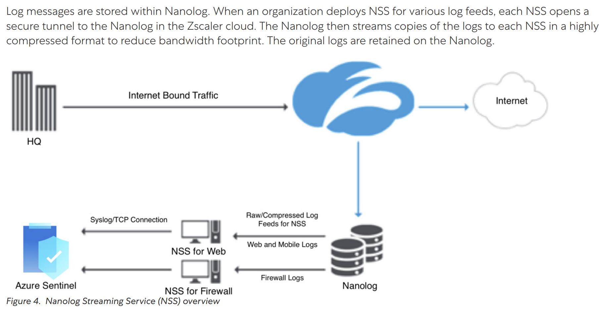

# Sentinel - my cheat sheet
## Correlation of quarantine log events to get full monitoring details
The customer use case is: *get an alert when a message is released from quarantine, providing also the name of the admin who performed the action.*
Actually it is not trivial as the EmailEvents and EmailPostDeliveryEvents M365D tables do not contain the admin username information.
In addition, the quarantine log you can get from the compliance.microsoft.com portal (Audit Logs) is not available either in the OfficeActivity table that comes today (October 2023) with the Microsoft 365 native connector of Microsoft Sentinel.

UPDATE Jan 2024: there is another option, leveraging the CloudAppEvents table of Defender for Cloud Apps! If you have the product, this is the simplest way, so move to: https://github.com/frantafr/m365d/blob/main/xdr/xdr.md#interesting-advanced-hunting-queries-with-cloudappevents-table

Here is a way to fulfill this ask.

### Prerequisites
In Microsoft Sentinel, you have already connected M365 Defender and M365, using the native connectors:
- https://learn.microsoft.com/en-us/azure/sentinel/connect-microsoft-365-defender?tabs=MDE
- https://learn.microsoft.com/en-us/azure/sentinel/data-connectors/microsoft-365

Thanks to those connectors, you should be able to get logs from EmailEvents and OfficeActivity tables.
For example:
```
EmailEvents | take 10
```
and 
```
OfficeActivity | take 10
```

### Use the community Azure Function to get Audit.General logs from O365 Management API
See and follow https://github.com/Azure/Azure-Sentinel/tree/master/DataConnectors/O365%20Data

One personal tip: during the installation I hit an issue, the O365_CL table was not appearing while the Azure Function looked ok.
For troubleshooting, I went to "Log Stream" menu, there I grab the following error: 
```
2023-10-05T08:25:08Z   [Error]   EXCEPTION: MCASActivity-SecurityEvents: Invalid Login Endpoint Uri. Exception             :     Type    : Microsoft.PowerShell.Commands.WriteErrorException     Message : MCASActivity-SecurityEvents: Invalid Login Endpoint Uri.     HResult : -2146233087 CategoryInfo          : NotSpecified: (:) [Write-Error], WriteErrorException FullyQualifiedErrorId : Microsoft.PowerShell.Commands.WriteErrorException,_TimerTrigger_ InvocationInfo        :     MyCommand        : _TimerTrigger_     ScriptLineNumber : 257     OffsetInLine     : 3     HistoryId        : 1     ScriptName       : C:\home\site\wwwroot\TimerTrigger\run.ps1     Line             : Write-Error -Message "MCASActivity-SecurityEvents: Invalid Login Endpoint Uri." -ErrorAction Stop                             PositionMessage  : At C:\home\site\wwwroot\TimerTrigger\run.ps1:257 char:3                        +         Write-Error -Message "MCASActivity-SecurityEvents: Invalid Lo …                        +         ~~~~~~~~~~~~~~~~~~~~~~~~~~~~~~~~~~~~~~~~~~~~~~~~~~~~~~~~~~~~~     PSScriptRoot     : C:\home\site\wwwroot\TimerTrigger     PSCommandPath    : C:\home\site\wwwroot\TimerTrigger\run.ps1     InvocationName   : _TimerTrigger_     CommandOrigin    : Internal ScriptStackTrace      : at <ScriptBlock>, C:\home\site\wwwroot\TimerTrigger\run.ps1: line 257

2023-10-05T08:25:08Z   [Error]   Executed 'Functions.TimerTrigger' (Failed, Id=85c42ab3-ca70-43d7-8eb9-4f7c1a18641e, Duration=8247ms)
```
Thanks to this message, and looking at the run.ps1 file, I understood there was an error with my LoginEndpoint variable. It was "https://login.microsoftonline.com/" while the script was expecting "https://login.microsoftonline.com"! Just one "/" was responsible of the error...

### Final: create the right KQL query
Now you have the data, you are able to join the info from the different table.
Here is an example. Here **I have both the details of the message released from quarantine as well as the admin name who performed the action!**
```
EmailPostDeliveryEvents
| where Action == "Quarantine release"
| extend NetworkMessageId_g=NetworkMessageId
| join (O365_CL | where Operation_s == "QuarantineReleaseMessage") on NetworkMessageId_g
| join (EmailEvents) on NetworkMessageId
| project TimeGenerated, ActionTrigger, ActionType, ActionResult, RecipientEmailAddress, AdminId=UserId_s, Operation_s, NetworkMessageId, Subject, SenderFromAddress, AuthenticationDetails, ConfidenceLevel
```


### What's next?
You can create an alert from this query, a report in a workbook or a full workflow depending on your needs!

## Zscaler NSS to Sentinel (cloud to cloud)
Well, there is a nice cloud to cloud integration between Zscaler NSS and Microsoft Sentinel, and a documentation published here: https://help.zscaler.com/zscaler-technology-partners/zscaler-and-microsoft-sentinel-deployment-guide.
If you follow it scrupulously it will eventually work... But the copy/paste from the pdf documentation to the Azure and Zscaler console is just a nightmare, so here are the different instructions to make life easier.
<p align="center"></p>

Next, I will put important data for web logs configuration "Configuring Sentinel for Cloud NSS-Based Log Ingestion" (p17 to p52). You may adapt it with your variables own values when necessary.
Sample of Web Logs (p27):
```
[
{ "sourcetype" : "zscalernss-web", "TimeGenerated":"2023-02-17 22:55:01", "act":"Blocked", "reason":"Blocked", "app":"HTTPS", "dhost":"www.etsy.com", "dst":"104.94.233.143", "src":"10.2.3.4", "sourceTranslatedAddress":"40.83.138.250", "in":"50", "out":"10", "request":"www.1etsy.com/dac/common/web-toolkit/scoped/scoped_responsive_base.20220526203537%2csite-chrome/deprecated/global-nav.20220526203537%2ccommon/web-toolkit/a11y_colors/overrides.20220526203537.css", "requestContext":"www.1etsy.com/c/clothing-and-shoes?ref=catnav-10923", "outcome":"200", "requestClientApplication":"Mozilla/5.0 (Windows NT 6.2; Win64; x64; rv:16.0.1) Gecko/20121011 Firefox/21.0.1", "requestMethod":"GET", "suser":"test3@bd-dev.com", "spriv":"Road Warrior", "externalId":"8106135709380313090", "fileType":"GZIP ", "destinationServiceName":"Etsy", "cat":"Professional Services", "deviceDirection":"1", "cn1":"10", "cn1Label":"riskscore", "cs1":"General Group", "cs1Label":"dept", "cs2":"Phishing", "cs2Label":"urlcat", "cs3":"None", "cs3Label":"malwareclass", "cs4":"None", "cs4Label":"malwarecat", "cs5":"Bad_Threat", "cs5Label":"threatname", "cs6":"None", "cs6Label":"md5hash", "rulelabel":"None", "ruletype":"None", "urlclass":"Advanced Security Risk", "DeviceVendor":"Zscaler", "DeviceProduct":"NSSWeblog" ,"devicemodel":"Virtual Machine" , "flexString1":"Virtual Machine", "flexString1Label":"devicemodel", "flexString2":"Advanced Security Risk", "flexString2Label":"urlclass"},
{ "sourcetype" : "zscalernss-web", "TimeGenerated":"2023-02-17 22:55:02", "act":"Allowed", "reason":"Allowed", "app":"HTTP_PROXY", "dhost":"c.bing.com", "dst":"204.79.197.200", "src":"40.90.198.229", "sourceTranslatedAddress":"40.90.198.229", "in":"6500", "out":"110", "request":"c.bing.com:443", "requestContext":"None", "outcome":"200", "requestClientApplication":"Windows Microsoft Windows 10 Pro ZTunnel/1.0", "requestMethod":"CONNECT", "suser":"testuser2@bd-dev.com", "spriv":"Road Warrior", "externalId":"7093275726860451849", "fileType":"None", "destinationServiceName":"SharePoint", "cat":"Web Search", "deviceDirection":"1", "cn1":"0", "cn1Label":"riskscore", "cs1":"Service Admin", "cs1Label":"dept", "cs2":"Web Search", "cs2Label":"urlcat", "cs3":"None", "cs3Label":"malwareclass", "cs4":"None", "cs4Label":"malwarecat", "cs5":"None", "cs5Label":"threatname", "cs6":"None", "cs6Label":"md5hash", "rulelabel":"None", "ruletype":"None", "urlclass":"Business Use", "DeviceVendor":"Zscaler" , "DeviceProduct":"NSSWeblog" , "devicemodel":"Lenovo" , "flexString1":"Lenovo", "flexString1Label":"devicemodel", "flexString2":"Advanced Security Risk", "flexString2Label":"urlclass" },
{ "sourcetype" : "zscalernss-web", "TimeGenerated":"2023-02-17 22:55:03", "act":"Blocked", "reason":"Access denied due to bad server certificate", "app":"HTTP_PROXY", "dhost":"hm.baidu.com", "dst":"103.235.46.191", "src":"52.233.90.167", "sourceTranslatedAddress":"52.233.90.167", "in":"65", "out":"55", "request":"ps.eyeota.net/pixel?pid=gdomg51&t=gif&cat=Economy&us_privacy=&random=1654532044229.2", "requestContext":"None", "outcome":"200", "requestClientApplication":"Windows Microsoft Windows 10 Pro ZTunnel/1.0", "requestMethod":"CONNECT", "suser":"test1@bd-dev.com", "spriv":"Road Warrior", "externalId":"9346135709564534789", "fileType":"None ", "destinationServiceName":"General Browsing", "cat":"Web Search", "deviceDirection":"1", "cn1":"0", "cn1Label":"riskscore", "cs1":"General Group", "cs1Label":"dept", "cs2":"Adware/Spyware Sites", "cs2Label":"urlcat", "cs3":"None", "cs3Label":"malwareclass", "cs4":"None", "cs4Label":"malwarecat", "cs5":"None", "cs5Label":"threatname", "cs6":"None", "cs6Label":"md5hash", "rulelabel":"Inspect_All", "ruletype":"SSLPol", "urlclass":"Business Use", "DeviceVendor":"Zscaler" , "DeviceProduct":"NSSWeblog" ,"devicemodel":"macbookpro", "flexString1":"macbookpro", "flexString1Label":"devicemodel", "flexString2":"Advanced Security Risk", "flexString2Label":"urlclass"}
]
```

Web Logs transformation KQL (p31):
```
source | project TimeGenerated, DeviceCustomString1Label = tostring(cs1Label), DeviceCustomString1 = tostring(cs1), DeviceCustomString2Label = tostring(cs2Label), DeviceCustomString2 = tostring(cs2), DeviceCustomString3Label = tostring(cs3Label), DeviceCustomString3 = tostring(cs3), DeviceCustomString4Label = tostring(cs4Label), DeviceCustomString4 = tostring(cs4), DeviceCustomString5Label = tostring(cs5Label), DeviceCustomString5 = tostring(cs5), DeviceCustomString6Label = tostring(cs6Label), DeviceCustomString6 = tostring(cs6), DeviceCustomNumber1Label = tostring(cn1Label), DeviceCustomNumber1 = toint(cn1), FlexString1Label = tostring(flexString1Label), FlexString1 = tostring(flexString1), FlexString2Label = tostring(flexString2Label), FlexString2 = tostring(flexString2), requestContext = tostring(requestContext), DeviceAction = tostring(act), ApplicationProtocol = tostring(app), DestinationHostName = tostring(dhost), DestinationIP = tostring(dst), SourceIP = tostring(src), RequestURL = tostring(request), out = toint(out), SentBytes = tolong(out), ReceivedBytes = tolong("in"), RequestClientApplication = tostring(requestClientApplication), RequestMethod = tostring(requestMethod), SourceUserName = tostring(suser), SourceUserPrivileges = tostring(spriv), ExternalID = toint(externalId), ExtID = tostring(externalId), FileType = tostring(fileType), DestinationServiceName = tostring(destinationServiceName), CommunicationDirection = tostring(deviceDirection), rulelabel = tostring(rulelabel) , ruletype = tostring(ruletype), urlclass = tostring(urlclass), devicemodel = tostring(devicemodel), DeviceVendor = tostring(DeviceVendor), DeviceProduct = tostring(DeviceProduct), DeviceEventClassID=tostring(act), EventOutcome = tostring(outcome) , Reason = tostring(reason) , Activity = tostring(reason), SourceTranslatedAddress = tostring(sourceTranslatedAddress)
```

Tip to change the Table’s Output Stream *without Azure cloudshell*, but by using the Azure portal (p36):
- Go to the DCR (steps 1 to 3)
- Click "Export Template" in the left menu, section "Automation"
- Click "Deploy"
- Click "Edit template"
- Modify the value of outputStream from your custom log table name to Microsoft-CommonSecurityLog
- Click Save, Next, Create

Configuring ZIA for Cloud NSS-Based Log Export: a step prone to error is "feed output format". Here it is:
Cloud NSS Feeds for Web Logs:
```
\{"sourcetype":"zscalernss-web", "TimeGenerated":"%d{yy}-%02d{mth}-%02d{dd} %02d{hh}:%02d{mm}:%02d{ss}", "act":"%s{action}", "reason":"%s{reason}", "app":"%s{proto}", "dhost":"%s{ehost}", "dst":"%s{sip}", "src":"%s{cip}", "sourceTranslatedAddress":"%s{cintip}", "in":"%d{respsize}", "out":"%d{reqsize}", "request":"%s{eurl}", "requestContext":"%s{ereferer}", "outcome":"%s{respcode}", "requestClientApplication":"%s{ua}", "requestMethod":"%s{reqmethod}", "suser":"%s{login}", "spriv":"%s{location}", "externalId":"%d{recordid}", "fileType":"%s{filetype}", "destinationServiceName":"%s{appname}", "cat":"%s{urlcat}", "deviceDirection":"1", "cn1":"%d{riskscore}", "cn1Label":"riskscore", "cs1":"%s{dept}", "cs1Label":"dept", "cs2":"%s{urlcat}", "cs2Label":"urlcat", "cs3":"%s{malwareclass}", "cs3Label":"malwareclass", "cs4":"%s{malwarecat}", "cs4Label":"malwarecat", "cs5":"%s{threatname}", "cs5Label":"threatname", "cs6":"%s{bamd5}", "cs6Label":"md5hash", "rulelabel":"%s{rulelabel}", "ruletype":"%s{ruletype}", "urlclass":"%s{urlclass}", "DeviceVendor":"Zscaler", "DeviceProduct":"NSSWeblog", "devicemodel":"%s{devicemodel}", "flexString1":"%s{devicemodel}", "flexString1Label":"devicemodel", "flexString2":"%s{urlclass}", "flexString2Label":"urlclass"\}
```

Finally one would perform a unit test case by using Powershell:
```
Add-Type -AssemblyName System.Web
##################
### Step 0: set parameters required for the rest of the script
##################
#information needed to authenticate to AAD and obtain a bearer token
$tenantId = "<your tenant guid>"; #Tenant ID the data collection endpoint resides in
$appId = "<your appid>"; #Application ID created and granted permissions
$appSecret = "<your appsecret>"; #Secret created for the application
#information needed to send data to the DCR endpoint
$dcrImmutableId = "your dcr immutable id"; #the immutableId property of the DCR object
$dceEndpoint = "https://<yourdce>.ingest.monitor.azure.com"; #the endpoint property of the Data Collection Endpoint object
$customTable="<Custom-table_CL>";

##################
### Step 1: obtain a bearer token used later to authenticate against the DCE
##################
$scope=[System.Web.HttpUtility]::UrlEncode("https://monitor.azure.com//.default") 
$body = "client_id=$appId&scope=$scope&client_secret=$appSecret&grant_type=client_credentials";
$headers = @{"Content-Type"="application/x-www-form-urlencoded"};
$uri = "https://login.microsoftonline.com/$tenantId/oauth2/v2.0/token"
$bearerToken = (Invoke-RestMethod -Uri $uri -Method "Post" -Body $body -Headers $headers).access_token

##################
### Step 2: Load up some sample data. 
##################
$currentTime = Get-Date ([datetime]::UtcNow) -Format O
$staticData = @"
[{ "sourcetype" : "zscalernss-web", "TimeGenerated":"2023-03-17 15:01:21", "act":"Blocked", "reason":"Blocked", "app":"HTTPS", "dhost":"www.etsy.com", "dst":"104.94.233.143", "src":"40.83.138.250", "sourceTranslatedAddress":"10.2.3.4","in":"50", "out":"10", "request":"www.1etsy.com/dac/common/web-toolkit/scoped/scoped_responsive_base.20220526203537%2csite-chrome/deprecated/globalnav.20220526203537%2ccommon/web-toolkit/a11y_colors/overrides.20220526203537.css", "requestContext":"www.1etsy.com/c/clothing-and-shoes?ref=catnav-10923", "outcome":"200", "requestClientApplication":"Mozilla/5.0 (Windows NT 6.2; Win64; x64; rv:16.0.1) Gecko/20121011 Firefox/21.0.1", "requestMethod":"GET", "suser":"testuser2@bd-dev.com", "spriv":"Road Warrior", "externalId":"8106135709380313090", "fileType":"GZIP ", "destinationServiceName":"Etsy", "cat":"Professional Services", "deviceDirection":"1", "cn1":"10", "cn1Label":"riskscore", "cs1":"General Group", "cs1Label":"dept", "cs2":"Phishing", "cs2Label":"urlcat", "cs3":"None", "cs3Label":"malwareclass", "cs4":"None", "cs4Label":"malwarecat", "cs5":"Bad_Threat", "cs5Label":"threatname", "cs6":"None", "cs6Label":"md5hash", "rulelabel":"None", "ruletype":"None", "urlclass":"Advanced Security Risk", "DeviceVendor":"Zscaler" , "DeviceProduct":"NSSWeblog" ,"devicemodel":"Virtual Machine" , "flexString1":"Virtual Machine", "flexString1Label":"devicemodel", "flexString2":"Advanced Security Risk", "flexString2Label":"urlclass"}]
"@;
##################
### Step 3: send the data to Log Analytics via the DCE.
##################
$body = $staticData;
$headers = @{"Authorization"="Bearer $bearerToken";"Content-Type"="application/json"};
$uri = "$dceEndpoint/dataCollectionRules/$dcrImmutableId/streams/$customTable"+"?api-version=2021-11-01-preview"
$uploadResponse = Invoke-RestMethod -Uri $uri -Method "Post" -Body $body -Headers $headers
#Invoke-WebRequest -UseBasicParsing -Uri $uri -Method "Post" -Body $body -Headers $headers
```