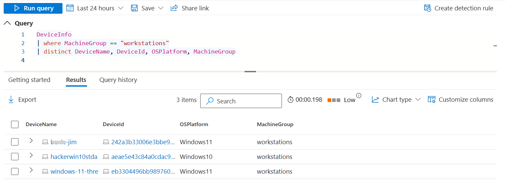
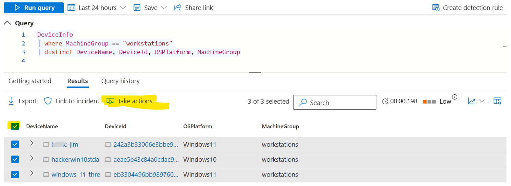
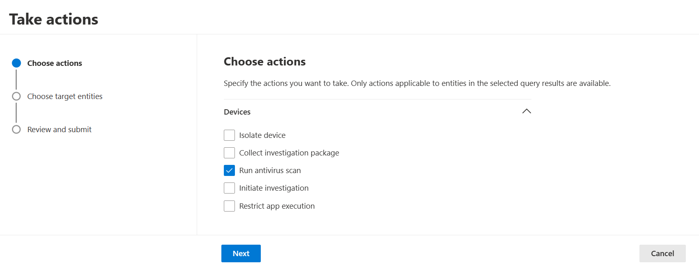
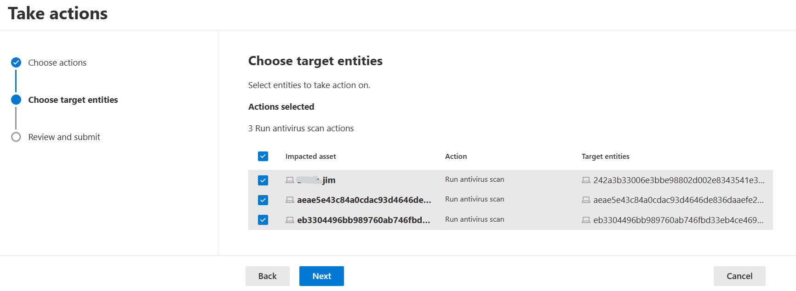
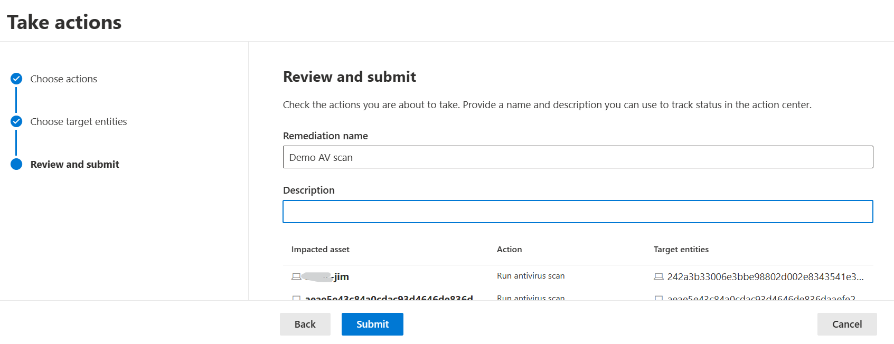
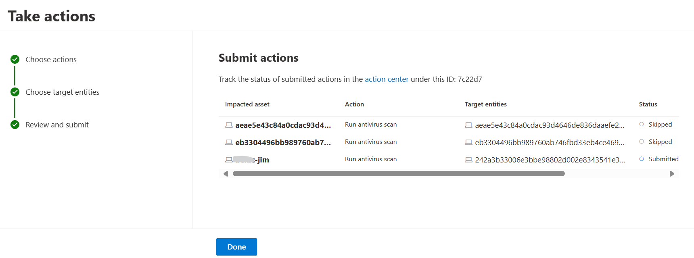

# Defender XDR - my cheat sheet
## Interesting advanced hunting queries with CloudAppEvents table
- Admins accessing emails? Which emails 📧?
```
CloudAppEvents
| where ActionType == "AdminMailAccess"
| extend extProperties = parse_json(parse_json(RawEventData)).ExtendedProperties
| mv-apply extProperties on (
    where tostring(extProperties.Name) == "InternetMessageId" | project InternetMessageId = url_decode(tostring(extProperties.Value))
  ) // extract the internetMessageId from MDCA data
| join EmailEvents on InternetMessageId // provides more details about the email accessed, including subject, sender, recipient
| join (IdentityInfo | distinct AccountUpn, AccountDisplayName, EmailAddress, JobTitle, Department) on $left.RecipientEmailAddress == $right.EmailAddress // provide more organization details including JobTitle about the Recipient the admin has accessed email 
| project Timestamp, ActionType, InternetMessageId, AdminName = AccountDisplayName, 
SenderFromAddress, RecipientEmailAddress, Subject, JobTitle, Department, ReportId
```

- Admins releasing messages from quarantine? which admins 👮‍♂️ and which emails?
```
CloudAppEvents 
| where ActionType == "QuarantineReleaseMessage"
| project Timestamp, AccountDisplayName, ActionType, NetworkMessageId=tostring(RawEventData.NetworkMessageId)
| join EmailPostDeliveryEvents on NetworkMessageId //join with audit log from MDO
| join EmailEvents on NetworkMessageId //add data from MDO email data, in order to provide more details about the message released
| project Timestamp, ActionType, AdminName = AccountDisplayName, SenderFromAddress, RecipientEmailAddress, Subject, 
DeliveryAction, LatestDeliveryAction, LatestDeliveryLocation, ThreatTypes1, ReportId
```

## Interesting advanced hunting queries focusing on non-human identities (SPNs / OAuth apps / workload identities)
- List/Visualize SPNs with activities in Exchange Online
```
let spns = (AADSpnSignInEventsBeta
| project ApplicationId, Application
| distinct ApplicationId, Application);
CloudAppEvents
| where AccountId in (spns)
| where Application == "Microsoft Exchange Online" //comment or change resource to monitor (Microsoft Azure, Microsoft 365, Microsoft SharePoint Online, Microsoft Power BI)
| join kind=inner spns on $left.AccountId == $right.ApplicationId
| summarize Count = count() by SPN=Application1, ActionType, Application, bin(Timestamp, 1d)
| order by SPN, Timestamp asc
//| project SPN, ActionType, Count | render columnchart //uncomment if you want a columnchart
```

- Review "add app role assignment to service principal" activity logs
```
CloudAppEvents
    //| where ActionType contains "service principal"
    | where ActionType == "Add app role assignment to service principal." // comment if you want to enlarge the search
    | extend extProperties=parse_json(RawEventData.ModifiedProperties)
    | mv-apply extProperties on (
        where tostring(extProperties.Name) == "AppRole.DisplayName" | project NewPermission=tostring(extProperties.NewValue)
    )
    | extend extProperties=parse_json(RawEventData.ModifiedProperties)
    | mv-apply extProperties on (
        where tostring(extProperties.Name) == "ServicePrincipal.DisplayName" | project SPNDisplayName=tostring(extProperties.NewValue)
    )
    | project Timestamp, ActionBy=AccountDisplayName, ActionType, SPNDisplayName, AppId=AccountId, NewPermission, ActivityObjects, RawEventData
```

- Logon spikes for SPNs, compared to baseline? Maybe something unusual is happening...🕵️‍♂️
```
//credit: https://github.com/microsoft/Microsoft-365-Defender-Hunting-Queries/blob/master/Webcasts/TrackingTheAdversary/Episode%203%20-%20Summarizing%2C%20Pivoting%2C%20and%20Joining.txt
let interval = 12h;
AADSpnSignInEventsBeta
| where isnotempty(Application)
| make-series LogonCount = count() on Timestamp from ago(30d) to now() step interval by Application
| extend (flag, score, baseline) = series_decompose_anomalies(LogonCount)
| mv-expand with_itemindex = FlagIndex flag to typeof(int) // Expand, but this time include the index in the array as FlagIndex
| where flag == 1 // Once again, filter only to spikes
| extend SpikeScore = todouble(score[FlagIndex]) // This will get the specific score associated with the detected spike
| summarize MaxScore = max(SpikeScore) by Application
| top 5 by MaxScore desc
| join kind=rightsemi AADSpnSignInEventsBeta on Application
| summarize count() by Application, bin(Timestamp, interval)
| render timechart
```
- Activities to Exchange Online spikes for SPNs, compared to baseline? Maybe something unusual is happening...🕵️‍♂️
```
//inspired by: https://github.com/microsoft/Microsoft-365-Defender-Hunting-Queries/blob/master/Webcasts/TrackingTheAdversary/Episode%203%20-%20Summarizing%2C%20Pivoting%2C%20and%20Joining.txt
let interval = 12h;
let spns = (AADSpnSignInEventsBeta
| project ApplicationId, Application
| distinct ApplicationId, Application);
CloudAppEvents
| where AccountId in (spns)
| where Application == "Microsoft Exchange Online" //comment or change resource to monitor (Microsoft Azure, Microsoft 365, Microsoft SharePoint Online, Microsoft Power BI)
| make-series ActivityCount = count() on Timestamp from ago(30d) to now() step interval by AccountId
| extend (flag, score, baseline) = series_decompose_anomalies(ActivityCount, 2.5, -1, 'linefit') //remove ", 2.5, -1, 'linefit'" for default values
| mv-expand with_itemindex = FlagIndex flag to typeof(int) // Expand, but this time include the index in the array as FlagIndex
| where flag == 1 // Once again, filter only to spikes
| extend SpikeScore = todouble(score[FlagIndex]) // This will get the specific score associated with the detected spike
| summarize MaxScore = max(SpikeScore) by AccountId
| top 5 by MaxScore desc
| join kind=rightsemi CloudAppEvents on AccountId
| join kind=inner spns on $left.AccountId == $right.ApplicationId
| summarize count() by SPN=Application1, bin(Timestamp, interval)
| render timechart
```

## Pro tip Defender; taking actions on multiple devices at the same time
Of course you can quickly take an action from the device page (isolate or run AV scan for exemple). But what if you want to do that on multiple devices at once? 
Currently you cannot to this from the Devices page but you can from Advanced Hunting!
- Click on Advanced Hunting
- Enter your query with appropriate filtering

- Select devices and click on Take actions button

- Check the action to take and click next

- Review the scope of devices targeted and click next

- Enter a remediation name, a description and click Submit

- Review the results and if necessary click on Action center to pivote to this view

